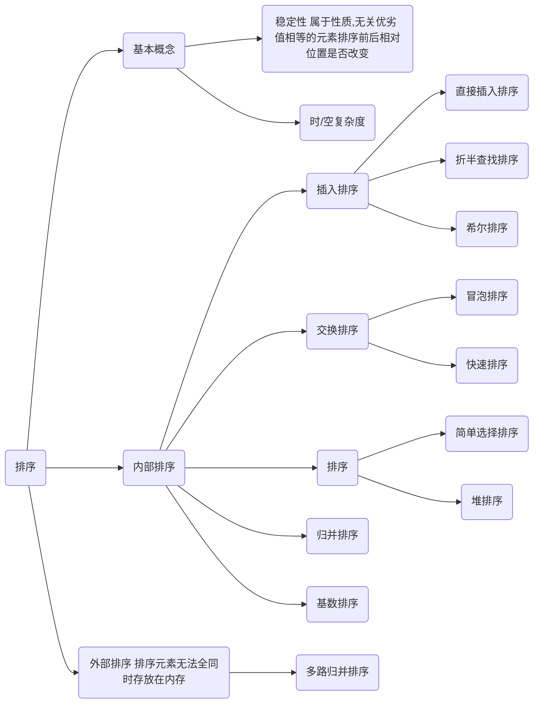

[TOC]

# 7  排序

## 7.1 排序的基本概念

## 7.2插入排序
### 7.2.1 直接插入排序
### 7.2.2 折半插入排序
### 7.2.3 希尔排序（shell sort）

## 7.3 交换排序
### 7.3.1 起泡排序(bubble sort)
### 7.3.2 快速排序

## 7.4 选择排序
### 7.4.1 简单选择排序
### 7.4.2 堆排序

## 7.5 二路归并排序（merge sort）

## 7.6 基数排序

## 7.7 外部排序

## 7.8 各种排序算法的比较

## 7.9 排序算法的应用

