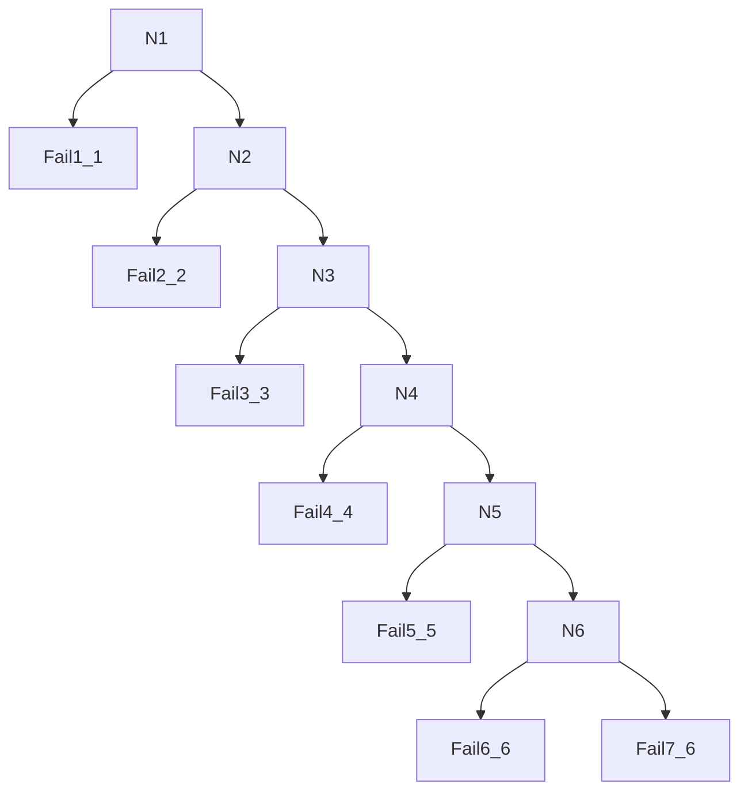

[ TOC ]

# 第六章 查找
## 6.1.查找的基本概念
在数据集合中寻找满足某种条件的数据元素的过程。

## 6.2.顺序查找法(又称为线性查找）

### 6.2.1 引入“哨兵”的线性表顺序查找
查找成功平均长度： n+1/2
查找不成功平均长度: n+1
```
typedef struct{
    ElemType *elem; // 0 is reserved, start from 1
    int TableLen;
}SSTable;

int Search_Seq(SSTable ST, ElemType key)
{
    ST.elem[0] = key;
    for (int i = ST.TableLen; elem[i] != key; i--)
    {
        ;
    }
    return i;
}
```
### 6.2.2 有序表的顺序查找
查找成功平均查找长度：n+1/2
查找不成功平均查找长度: [n(n+1)/2 + n] / n+1 = n/2 + n/(n+1)


## 6.3 折半查找（二分查找）
仅适用于有序的顺序表（**顺序表是存储结构哦**）

**对应二叉判定树有 n个圆形结点和n+1个方形结点**
```
int Binary_Search(SeqList L, ElemType key)
{
    // 在有序表L中查找关键字为key的元素，若存在则返回其位置，不存在则返回-1
    int low=0, high=L.TableLen-1, mid;
    while(low <= high)
    {
        mid = (high + low)/2;
        if (L.elem[mid] == key)
        {
            return mid;
        }
        else if (L.elem[mid] > key)
        {
            high = mid - 1;
        }
        else
        {
            low == mid + 1;
        }
    }
    return -1;
}
```

## 6.4 分块查找 （索引顺序查找）
将查找表分为若干子块。块内可以无序，块间有序。索引表中每个元素含有各块的最大关键字和各块第一个元素的地址，索引表按关键字有序排列。

查找可以分两步 
1. 在索引表中确定待查记录所在的块(可以顺序查找或折半查找)
2. 在块内顺序查找

s=根号n时 平均查找长度最小
公式不好打 此处需要看王道以及课后习题。

## 6.5 B树及其基本操作 和 B+树的概念 


